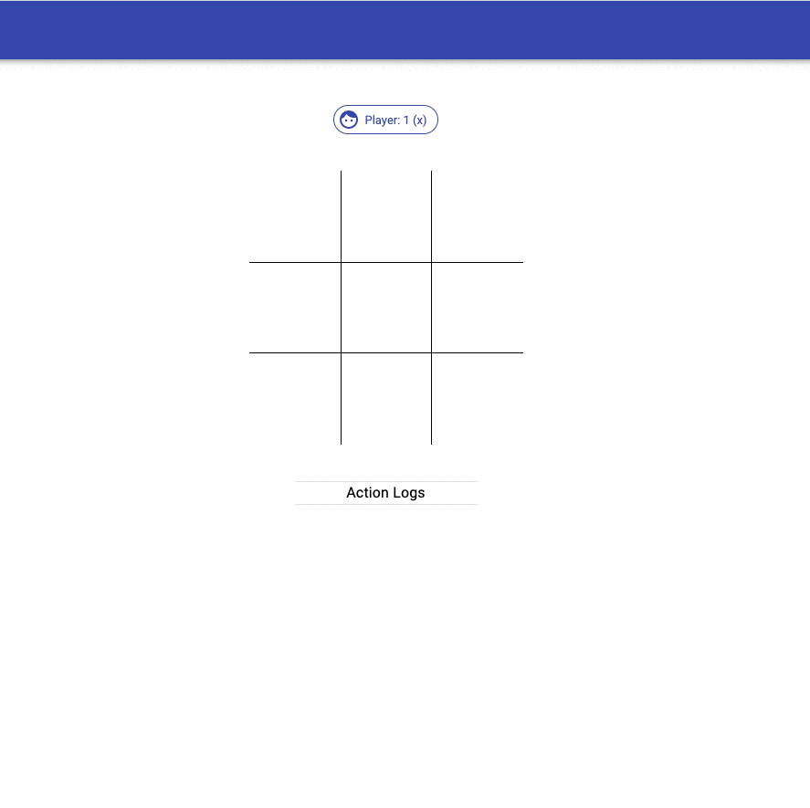
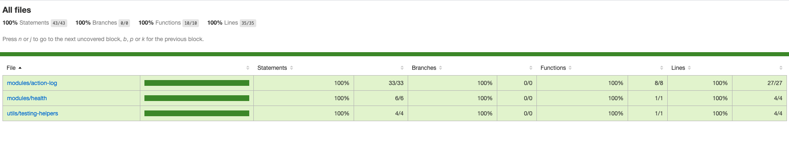
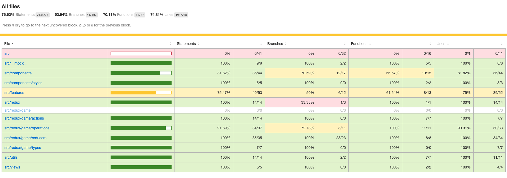
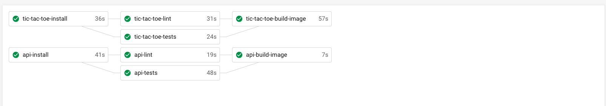

## Tic Tac Toe Using ReactJs and NestJs
[](https://circleci.com/gh/shamrat17/react-tic-tac-toe) [](https://codecov.io/gh/shamrat17/react-tic-tac-toe)

This is a simple game implementation with ReactJs and NestJs api backend.

## Getting Started
### Requirements:
- [Node js](https://nodejs.org/en/download/) >= 12
- [Docker](https://www.docker.com/community-edition)

### Clone the repo
```sh
    git clone https://github.com/shamrat17/react-tic-tac-toe.git
    cd react-tic-tac-toe
```
- Run command `make`

Note: keep little patience, for the first time run `make` does all the dependency installation and make the service up via docker-compose. So for next time you just need to run `make start`

### Once the all services are up, you can access the following URLs:
- Api-server (backend): http://localhost:4000/
- Tic-tac-toe (frontend): http://localhost:3000/





## Testing
WE've mocked all the api/db dependent stuff so you can run tests without running the services and they can be tested independently.

- api-service: 
```sh
  cd api-service
  npm test
```
- tic-tac-toe-service: 
```sh
  cd tic-tac-toe
  npm test
```

Coverage reports 
- api-service

- tic-tac-toe



## CI-CD
Integrated with circle ci and tests are running on the pipeline with preserving the artifacts though image building stuff is remaining.

- This is how workflow looks right now
